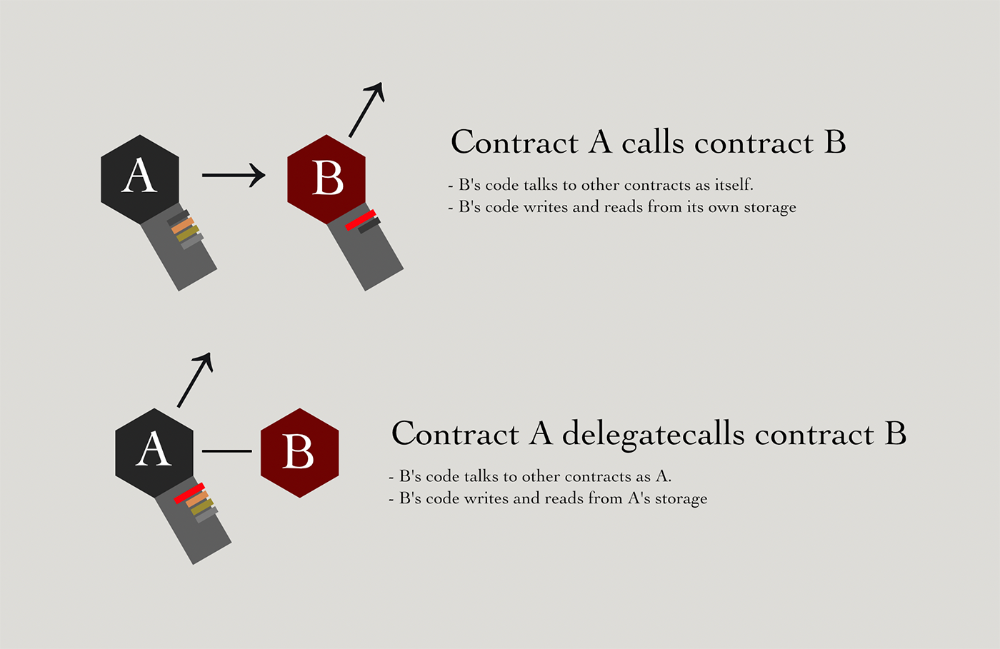

# 2021-2-27 Furucombo Attack

_Daniel Von Fange_

## What happened

An attacker drained $14 million dollars worth of funds from accounts that had approved the Furucombo proxy to transfer their funds. The Furucombo proxy allowed executing remote code from dozens of different contracts as if it was the Furucombo proxy running the code itself. This allowed the attacker to set the Furucombo storage such that they had total control of the Furucombo proxy. With the ability to run arbitrary code, the attacker had the proxy execute batched transfers of users' coins to the attacker.

## How it works

### Background: Delegatecall

Normally, each Ethereum contract is the the only one in the universe that can write to its own storage memory, and can only interact with other contracts by sending messages which other contracts are free to ignore.

These protections all go away when one contract DELEGATECALLs to another. DELEGATECALL grabs the code from another contract and runs that code it as if it were the contract that called it, giving the code full access to everything that the calling contract has, and appearing to the outside world as if every action taken was done by the calling contract.

DELEGATECALL is as if you were playing basketball with your buddies and could temporarily replace your mind with a  copy of Zion Williamson's for a play, while keeping your physical body on the court. This requires a crazy amount of trust. It's possible that the the person you chose to control your mind might instead take out big loans in your name and send the funds to Moldova.

There's one very valid use for DELEGATECALL. The code in an in ethereum contract cannot be changed. (_This is ethereum, so of course contract code can be changed in certain circumstances_). But many projects, OUSD included, want to be able to upgrade their contracts to add new features or reduce gas usage without requiring all  users to take their funds out of the old contracts and put them into the new contracts with new features. The solution to this is to have a "proxy contract" that acts as the public face of the project. This proxy contract takes whatever message is sent to it and DELEGATECALL's it to an "implementation contract" that contains the code doing the real work. The implementation contract then runs as if it was the front contract, and has full access to all funds that belong to the front contract, and all access that others have given the front contract. When it is time to upgrade, the project just changes which implimentation contract the proxy delegates to.

This proxy/implementation pattern is the leading way to do upgradeability. Projects holding billions of dollars use it, including AAVE, Compound, and USDC.

Furucombo however, was not using DELEGATECALL for upgradability to their own trusted contracts. Instead they were allowing the public to send in a list of contracts to run code on, and step through that list, DELEGATECALL'ing to each, temporarily replacing the Furucombo code with the requested other contract's code and running it. Furucombo did have a whitelist of allowed contracts that could be called, but this was still extremely dangerous.

### 1. The attack contract

The [attack contract](https://etherscan.io/address/0x86765dde9304bea32f65330d266155c4fa0c4f04) is tiny at 1,279 bytes. Looking at a [decompiled version](https://contract-library.com/contracts/Ethereum/0x86765dde9304bea32f65330d266155c4fa0c4f04) we can see that it  checks that it is being run by the attacker, and then a loops through making whatever calls the attacker had instructed.

Unlike many attack contracts that have the exact blueprint of the attack sequence built into them, this one appears empty of apparent purpose. It could serve as an arbitrage bot, or could be a way a put complex sequence of transactions together. There's no warning from looking at the contract that it attacks any specific target, or is an attack contract at all.

In a sense, the attack contract is extremely like the Furucombo contract itself.

### 2. The takeover

[0x6a14869266a1dcf3f51b102f44b7af7d0a56f1766e5b1908ac80a6a23dbaf449](https://etherscan.io/tx/0x6a14869266a1dcf3f51b102f44b7af7d0a56f1766e5b1908ac80a6a23dbaf449)

The Furucombo proxy had a whitelist of contracts that it would delegate to, including the AAVE proxy contract. When the Furucombo Proxy was instructed to delegate call to the AAVE proxy, then then Furucombo code would turn into running the AAVE proxy. The AAVE proxy code would in turn load look at a storage slot for its implementation code and DELEGATECALL to that code. However, if this implementation address storage location had never been blank then it could be set by the first person to initialize it.

On the actual AAVE proxy contract, this storage slot was set long ago. But when the AAVE proxy code was run in the context of the Furucombo proxy, the AAVE code was reading and writing to the Furucombo storage, and in those storage slots the AAVE setup process had not been run yet.

The attacker had the Furucombo proxy become the AAVE proxy, then  run the initialize with the attacker's contract as the new implementation.

From now on, whenever the Furucombo proxy was called to delegate to AAVE, the the AAVE proxy code would in turn look in the furucombo's storage, and would delegate to the attacker's contract. The attacker could now run any code desired as if it were actual written as the Furucombo code.

### 3. Stealing funds

Sample transaction: [0x8bf64bd802d039d03c63bf3614afc042f345e158ea0814c74be4b5b14436afb9](https://etherscan.io/tx/0x8bf64bd802d039d03c63bf3614afc042f345e158ea0814c74be4b5b14436afb9)

The attacker now had total control.  Unlike many attacks which focus on funds held by the attacked contracts, this attacker went after whales who had approved the furucombo contract to transfer their money.

The attacker batched up multiple transferFrom to run as the Furucombo Proxy, moving the the victims funds directly from the victims wallets to the attackers.

## What allowed this to happen?

First, it was incredibly risky to allow passing arbitrary arguments to a whole list of DELEGATECALL'd external contracts. This would be almost impossible to secure, and catastrophic if something failed.

Secondly, I don't understand why the AAVE proxy was in the whitelist. It could not have ever done anything useful when DELEGATE called by Furucombo, since it would not actually have been the real AAVE - it would have had no funds and no users. 

The AAVE proxy was added to whitelist at the same time the rest of the whitelist was setup. The Furucombo proxy was  vulnerable since since then.

Lastly this attack worked because there were approvals to the Furucombo proxy on accounts with millions of dollars of funds. In the case of an attacker gaining the ability to run their own code as a contract, not only are the funds in a contract at risk, but also any funds that have been approved to that contract.

## Are we vulnerable?

OUSD is not vulnerable to this attack style. We only use delegatecall for contract upgradability, using the battle tested OpenZeppelin library. We also have a code review checklist item for not allowing the use of delegatecall outside this.

OUSD also has separate internal contracts for each strategy it uses, and the strategies have their own funds and approvals to the the underlying DeFi projects that we use. This means that even if the Compound USDT contract were compromised like this, it could not directly take USDT from the OUSD vault, since only our Compound strategy contract has an outstanding approval to transfer USDT to Compound USDT.